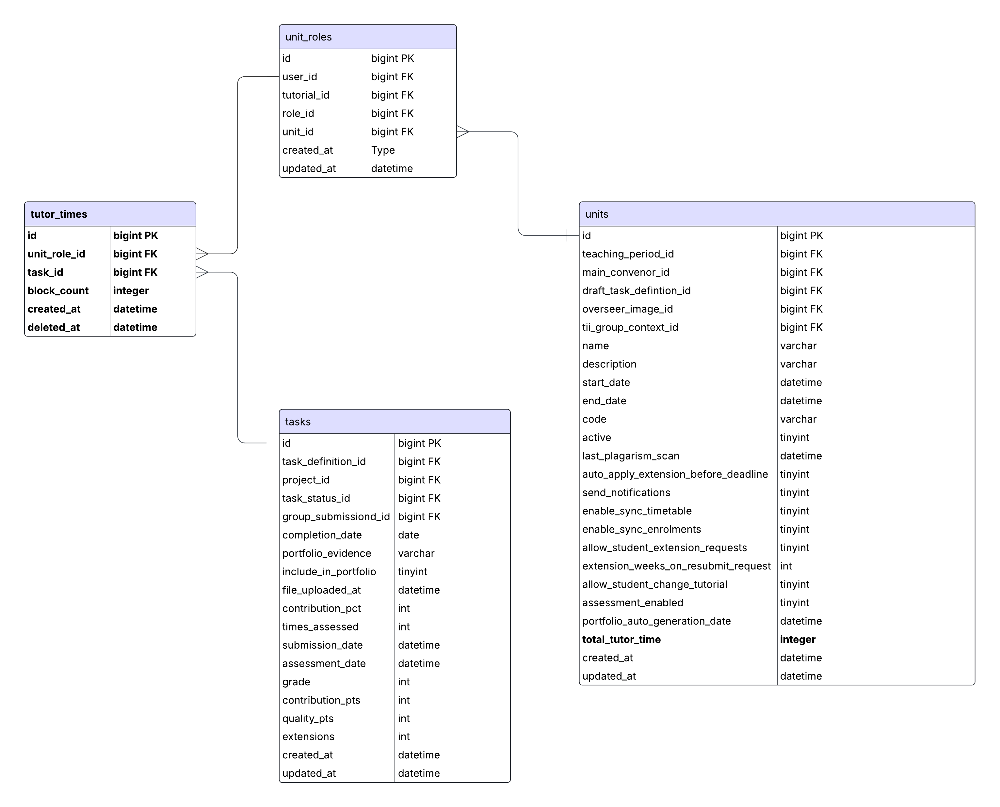

## 1. Introduction

### 1.1 Purpose

This document outlines the backend design for the "Tutor Times" feature in OnTrack. The purpose is to define the architectural, data, and API-level implementation details to support efficient tracking and management of tutor marking time across units and tasks.

### 1.2 Scope

This design covers:

- Data Models and Schema
- RESTful API Endpoints
- Authentication and Authorization
- Background Jobs / Triggers
- Session Lifecycle and Timeout Logic
- Data Aggregation and Integrity Constraints
- Performance Optimization
- Security
- Compatibility with Frontend and Related Modules

### 1.3 Intended Audience

This document is for backend developers, technical leads and other stakeholders involved in implementing the Tutor Times feature.

---

## 2. Architecture and Data Models

### 2.1 Data Storage

- Introduce a new table: `tutor_times` to track individual marking sessions.
- A new column `total_tutor_time` will be added to the `units` table to store the sum of completed tutor sessions.

### 2.2 Entity-Relationship Diagram (ERD)

The following ERD illustrates the relationships between `tutor_times`, `unit_roles`, `tasks`, and `units`.

### 2.3 Schema Definition

#### `tutor_times` Table

| Column         | Type     | Notes                                   |
| -------------- | -------- | --------------------------------------- |
| `id`           | bigint   | Primary key                             |
| `unit_role_id` | bigint   | FK to `unit_roles`                      |
| `task_id`      | bigint   | FK to `tasks`                           |
| `block_count`  | integer  | Number of 5-minute blocks (must be ≥ 1) |
| `created_at`   | datetime | Auto-generated                          |
| `deleted_at`   | datetime | Nullable; for soft-deletion             |

#### `units` Table (Update)

| Column             | Type    | Notes                                                       |
| ------------------ | ------- | ----------------------------------------------------------- |
| `total_tutor_time` | integer | In seconds, calculated from non-deleted, completed sessions |

### 2.4 Relationships

- `unit_roles.id` → `tutor_times.unit_role_id` (many-to-one)
- `tasks.id` → `tutor_times.task_id` (many-to-one)
- `unit_roles` ↔ `units`: Provides unit context for each tutor session

### 2.5 Data Integrity Constraints

- No overlapping `active` sessions for the same `unit_role_id`
- `end_time` must be greater than `start_time`
- `duration_seconds` must be positive for completed sessions

---

## 3. API Design

### 3.1 Endpoints

| Endpoint                                  | Method   | Description                                                              |
| ----------------------------------------- | -------- | ------------------------------------------------------------------------ |
| `/api/tutor-time`                         | `POST`   | Create a new tutor time block entry (e.g., `block_count: 3`).            |
| `/api/tutor-time/:id`                     | `GET`    | Retrieve a specific time block entry.                                    |
| `/api/tutor-time/:id`                     | `PUT`    | Update a specific time block entry.                                      |
| `/api/tutor-time/:id`                     | `DELETE` | Soft-delete a time block using the `deleted_at` field.                   |
| `/api/tutor-time/unit-role/:unit_role_id` | `GET`    | Retrieve all time block entries for a given unit role.                   |
| `/api/tutor-time/unit/:unit_id`           | `GET`    | Retrieve all time block entries for a given unit, across all unit roles. |

### 3.2 Session Lifecycle

- Inactivity logic:
  - After 10 minutes of inactivity (as detected by the frontend), a session is automatically paused

---

## 4. Authentication and Authorization

- API requires valid authentication (e.g. via session token or OAuth)
- Tutors:
  - Can create, view, and update their own sessions
- Unit Chairs:
  - Can view all sessions related to their units
- Admins:
  - Can view and manage all sessions for audit/debugging purposes

---

## 5. Background Jobs & Triggers

### 5.1 Aggregation Logic

- Background job or trigger recalculates `total_tutor_time` in the `units` table whenever:
  - A session is added, updated, or soft-deleted

---

## 6. Non-Functional Requirements

### 6.1 Performance

- Use appropriate indexing on `unit_role_id`, `task_id`, and `status`
- Ensure efficient joins between `tutor_times`, `unit_roles`, and `units`

### 6.2 Security

- Enforce role-based access control
- Use HTTPS and encrypted API tokens
- Secure sensitive information and log access appropriately

---

## 7. Testing Strategy

### 7.1 Unit Testing

- Test all API endpoints individually
- Ensure correct behavior on inactivity-triggered pauses

---

## 8. Deployment Plan

### 8.1 Environment

- Deploy to staging, then production following standard CI/CD pipelines

---

## 9. Conclusion

This document provides a detailed backend design for the Tutor Times feature, covering schema changes, API endpoints, background jobs, and integration considerations. By following this design, the system will support accurate, secure, and user-friendly tracking of marking time for tutors.

---
