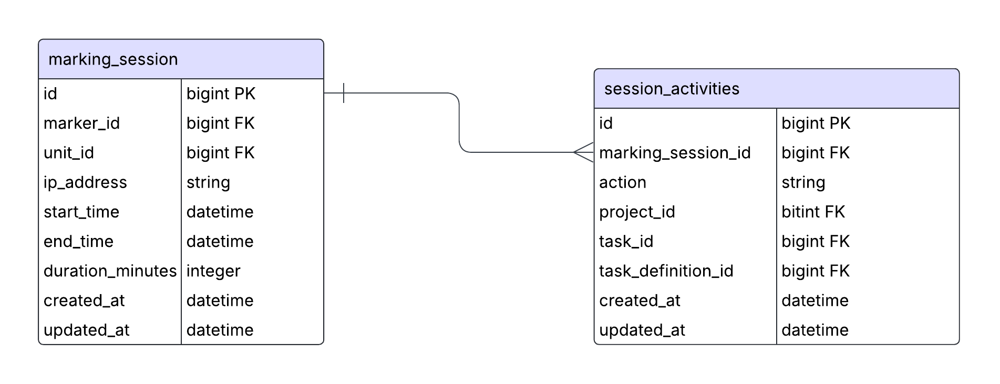

## 1. Introduction

### 1.1 Purpose

This document outlines the backend design for the "Tutor Times" and assessment analytics feature in OnTrack. It defines the architecture, schema, and API-level implementation details to support real-time tracking and management of tutor marking sessions across units and tasks.

### 1.2 Scope

This design covers:

- Data Models and Schema (updated to support real-time analytics)
- RESTful API Endpoints
- Real-Time Tracking Integration
- Authentication and Authorization
- Session Lifecycle and Timeout Logic
- Data Aggregation and Integrity Constraints
- Performance Optimization
- Security
- Compatibility with Frontend and Related Modules

### 1.3 Intended Audience

This document is for backend developers, technical leads, and other stakeholders involved in implementing and maintaining the Tutor Times and Assessment Analytics features.

---

## 2. Architecture and Data Models



### 2.1 Data Storage

- Introduce new tables:
  - `marking_sessions` – captures marking periods tied to tutors and units.
  - `session_activities` – logs discrete user interactions like task assessments.

### 2.2 Schema Definition

#### `marking_sessions` Table

| Column             | Type     | Notes                                   |
| ------------------ | -------- | --------------------------------------- |
| `id`               | bigint   | Primary key                             |
| `marker_id`        | bigint   | FK to `users`, tutor performing marking |
| `unit_id`          | bigint   | FK to `units`                           |
| `ip_address`       | string   | IP address of tutor                     |
| `start_time`       | datetime | Session start                           |
| `end_time`         | datetime | Session end                             |
| `duration_minutes` | integer  | Total duration                          |
| `created_at`       | datetime | Auto-generated                          |
| `updated_at`       | datetime | Auto-generated                          |

#### `session_activities` Table

| Column               | Type     | Notes                                           |
| -------------------- | -------- | ----------------------------------------------- |
| `id`                 | bigint   | Primary key                                     |
| `marking_session_id` | bigint   | FK to `marking_sessions`                        |
| `action`             | string   | e.g. `'inbox'`, `'GET'`, `'PUT'`, `'assessing'` |
| `project_id`         | bigint   | Optional FK                                     |
| `task_id`            | bigint   | Optional FK                                     |
| `task_definition_id` | bigint   | Optional FK                                     |
| `created_at`         | datetime | Auto-generated                                  |
| `updated_at`         | datetime | Auto-generated                                  |

### 2.3 Relationships

- `marking_sessions.marker_id` -> `users.id`
- `marking_sessions.unit_id` -> `units.id`
- `session_activities.marking_session_id` -> `marking_sessions.id`

### 2.4 Data Integrity Constraints

- A session must be unique per (user, unit, IP) in a rolling time window (e.g. 15 minutes).
- duration_minutes must be positive for completed sessions.
- action must be whitelisted (inbox, GET, PUT, assessing, etc.).

---

## 3. API and Tracking Logic

### 3.1 Tracking Integration Points

Use the new SessionTracker service in endpoints like so:

```ruby
if current_user.tutor? && @task.project.user != current_user
  SessionTracker.record_assessment_activity(
    action: 'assessing',
    user: current_user,
    project: @task.project,
    task: @task,
    ip_address: request.remote_ip
  )
end
```

### 3.2 SessionTracker Service

This service class handles the lifecycle of marking sessions and their associated activities. It abstracts away the logic for determining whether to continue an existing session or start a new one based on user, unit, IP address, and recent activity. It also ensures that relevant session statistics—like assessment counts and durations—are updated in real time whenever an action (like marking) is recorded.

```ruby
class SessionTracker
  THRESHOLD = 15 # minutes

  def self.record_assessment_activity(action:, user:, project:, task: nil, ip_address:)
    session = find_or_create_session(user, project.unit, ip_address)

    activity = session.activities.create!(
      action: action,
      project_id: project.id,
      task_id: task&.id,
      task_definition_id: task&.task_definition_id,
      created_at: DateTime.now
    )

    session.update_session_details if action == 'assessing'
    activity
  end

  def self.find_or_create_session(user, unit, ip_address)
    session = MarkingSession.where(
      marker: user,
      unit: unit,
      ip_address: ip_address
    ).where("updated_at > ?", THRESHOLD.minutes.ago).last

    unless session
      session = MarkingSession.create!(
        marker: user,
        unit: unit,
        ip_address: ip_address,
        start_time: DateTime.now
      )
    end

    session
  end
end
```

---

## 4. Authentication and Authorization

- Tutors: can only record their own session activities.
- Unit Chairs and Admins: can view aggregated session data.

---

## 5. Background Jobs & Triggers

### 5.1 Aggregation Logic

- Real-time data stored directly in marking_sessions and session_activities.
  - Nightly job for parsing CSV logs is no longer needed.

---

## 6. Non-Functional Requirements

### 6.1 Performance

- Index marking_sessions on (marker_id, unit_id, ip_address, updated_at)
- Index session_activities on action, task_id, and created_at

### 6.2 Security

- Ensure SessionTracker only accepts input from authenticated requests.
- Use encrypted session tokens; store IPs carefully (with privacy policies).

---

## 7. Testing Strategy

### 7.1 Unit Testing

- Add tests for SessionTracker.record_assessment_activity
- Test controller hooks for update, inbox, and assessing actions

---

## 8. Deployment Plan

### 8.1 Environment

- Deploy to staging, then production following standard CI/CD pipelines

---

## 9. Conclusion

This updated design integrates real-time assessment tracking via the SessionTracker service and two new data models. This approach replaces deferred processing with live analytics, allowing for more accurate, responsive tutor activity tracking while simplifying background job complexity.

---
