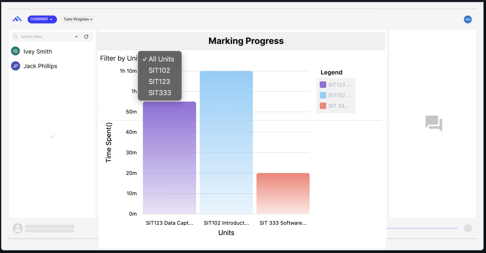
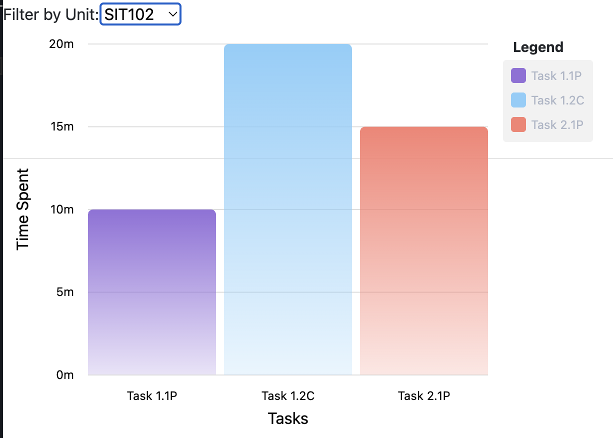
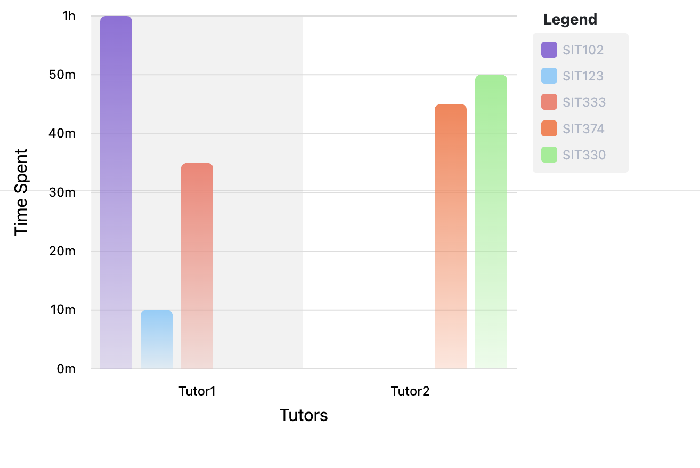

## 1. Introduction

### 1.1 Purpose
This document outlines the design of the frontend for the "Tutor Times" feature in OnTrack (formerly known as Doubtfire). The purpose is to provide an intuitive and user-friendly interface for tutors to track and manage the time spent on providing feedback to students.

### 1.2 Scope
The scope of this design document covers the user interface (UI) and user experience (UX) aspects of the "Tutor Times" feature within the OnTrack Learning Management System. This feature will enhance  model by enabling tutors to monitor their time management efficiently.

### 1.3 Intended Audience
This document is intended for frontend developers, designers, and stakeholders involved in the implementation of the "Tutor Times" feature.

## 2. User Interface (UI) Design

### 2.1 Overview
The "Tutor Times" feature will seamlessly integrate into the existing OnTrack UI, maintaining a cohesive visual identity and navigation structure.

### 2.2 Wireframes and Mockups

#### 2.2.1 Time Dashboard for Tutors

The dashboard provides an overview of marking time statistics, including total time spent on a task and time spent per student.

#### 2.2.2 Time Stats for Admin

The page displays a list of tutors and their respective marking times for each unit.

### 2.3 Responsive Design
The UI will be responsive to ensure a consistent user experience across various devices, including desktops, tablets, and mobile phones.

### 2.4 Colour Scheme
- **Primary Colour**: OnTrack primary colour
- **Secondary Colour**: OnTrack secondary colour
- **Text Colour**: OnTrack text colours

### 2.5 Typography
- **Headings**: OnTrack head text font (Bold)
- **Body Text**: OnTrack body text font (Regular)
- **Buttons**: OnTrack button text (Semi-Bold)

### 2.6 Icons
Standard icons will be used for actions such as starting and stopping timers, along with custom icons for notifications.

### 2.7 Navigation
The "Marking Time" feature will be accessible through the main navigation menu within OnTrack. Clear breadcrumbs will guide users through the application.

### 2.8 Notifications
Notifications will be displayed at the top of the dashboard, providing real-time feedback on marking progress and milestones.

### 2.9 User Profiles
Tutors will have access to their profiles to view personal information and settings.

## 3. User Experience (UX) Design

### 3.1 User Flows

#### 3.1.1 Checking Dashboard for Session Updates
1. **Tutor logs into OnTrack** and  directed to their personalized dashboard from tutor times option,
2. Tutors can **view session summaries** and their **total time spent** on marking tasks across units on the dashboard.
3. The **Activity Log** on the dashboard will display logged activities, such as "assessing", "inbox", or "completed", with timestamps.
4. Tutors can see aggregated **session data** for each unit and task to track their progress in real time.

### 3.2 Interactive Features

#### 3.2.1 Real-Time Session Updates
- The frontend will display real-time updates of the tutor's session status (e.g., active, paused, completed) based on backend data. 

#### 3.2.2 Activity Log
- Tutors will have an activity log that records actions such as "Assessing", "In Progress", and "Completed" for each marking task.
- The activity log will be updated in real-time based on the API calls made to the backend.

#### 3.2.3 Data Aggregation Dashboard
- Tutors will be able to view an aggregated summary of their total marking time across units and tasks.
- The dashboard will show visual elements like progress bars, pie charts, or line graphs summarizing their session data.

## 4. Interactive Features

### 4.1 Visualisation Dashboard (`ngx-graph`)
- Tutors will see a graph-based layout (using [ngx-graph](https://swimlane.github.io/ngx-graph/) and [ngx-chart](https://github.com/swimlane/ngx-charts)) of marking time broken down by:
  - Units
  - Tasks
  - Time per student

### 4.2 Admin Visibility
- Admins can view marking time statistics for all tutors.
- Admins can filter by:
  - Tutor
  - Unit

### 4.3 Notification System
- Real-time notifications will alert tutors of milestones and progress, enhancing user engagement. These notifications will be displayed in a dedicated section, ensuring tutors are notified of important time milestones or completion of tasks.

## 5. Performance Considerations

### 5.1 Page Load Times
Efforts will be made to optimize page load times to ensure a seamless user experience.

### 5.2 Caching
Caching mechanisms will be implemented to reduce load times and improve overall performance.

## 6. Compatibility

### 6.1 Browser Compatibility
- Supported browsers: Chrome, Firefox, Safari, Edge
- Cross-browser compatibility will be ensured.

### 6.2 Device Compatibility
Responsive design will ensure compatibility with various devices, including desktops, tablets, and mobile phones.

## 7. Security

### 7.1 Data Security
- User data will be securely stored and protected against unauthorized access.

### 7.2 HTTPS
- HTTPS will be enforced to secure data transmission between the frontend and backend.

## 8. Version Control and Collaboration

### 8.1 Version Control
- Git will be used for version control, following a branching strategy for collaborative development.

### 8.2 Collaboration Tools
- Tools like MsTeams and project management software will facilitate communication among team members.

## 9. Testing Plan

### 9.1 Unit Testing
- Unit tests will be developed for frontend components, including timers, input forms, and notifications.

### 9.2 User Acceptance Testing
- User acceptance testing (UAT) will ensure that the "Tutor Times" feature meets user requirements and expectations.

## 10. Deployment Plan

### 10.1 Deployment Environment
- The feature will be deployed to the OnTrack production environment.

### 10.2 Deployment Process
- A systematic deployment process will be followed to release frontend updates to the live environment.

## 11. Conclusion
This design document provides a comprehensive plan for the frontend implementation of the "Tutor Times" feature in OnTrack. It outlines the UI/UX design, interactive features, performance considerations, compatibility, security measures, and testing strategies. This design will enhance the learning experience for tutors and students, promoting efficient time management and feedback delivery.

## 12. Appendices
- Once the feature is implemented, a link will be provided to the frontend repository.
