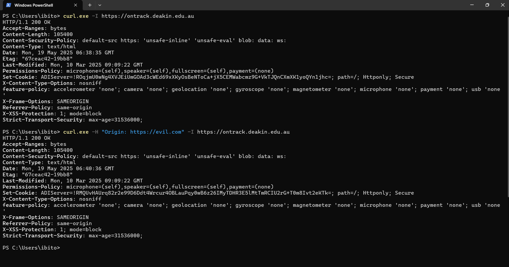

### Introduction

This document provides a detailed assessment of the Cross-Origin Resource Sharing (CORS) configuration for the OnTrack web application. It investigates a previously reported CORS vulnerability affecting a development instance and verifies whether the same misconfiguration exists in the current production environment.

**Target Application:** OnTrack Web Application
**Tested URL:** https://ontrack.deakin.edu.au
**Date of Testing:** 19 May 2025
**Assessor:** Ibitope Fatoki

---

### Background

A prior penetration test report identified a CORS misconfiguration on the OnTrack web application running on a development server (`http://172.18.0.1:4200`). That instance responded with:

```
Access-Control-Allow-Origin: *
```

Such a configuration enables any external website to send authenticated requests to the API endpoints, potentially resulting in unauthorized access if sessions or tokens are leaked or guessed.

Given the critical nature of such a vulnerability, we aimed to verify whether this misconfiguration persists in the production version of the application accessible at `https://ontrack.deakin.edu.au`.

---

### Methodology

#### Tool Used

- **Command Line Utility:** `curl.exe` on Windows (to bypass PowerShell’s alias for curl)

#### Test 1 – Baseline Header Inspection

- **Command:**
  `curl.exe -I https://ontrack.deakin.edu.au`
- **Purpose:**
  Inspect default HTTP response headers and verify whether CORS headers are exposed by default.

#### Test 2 – Simulated Malicious Origin Request

- **Command:**
  `curl.exe -H "Origin: https://evil.com" -I https://ontrack.deakin.edu.au`
- **Purpose:**
  Simulate a cross-origin request and observe whether the server reflects the Origin header via `Access-Control-Allow-Origin`.

#### Proof of Testing


*Figure: Output of CORS header tests showing no unsafe headers present in either default or custom Origin requests.*

---

### Findings

#### 4.1 Response to Baseline Header Request

```
HTTP/1.1 200 OK
...
Content-Security-Policy: default-src https: 'unsafe-inline' 'unsafe-eval' blob: data: ws:
X-Frame-Options: SAMEORIGIN
Strict-Transport-Security: max-age=31536000
...
(No Access-Control-Allow-Origin header present)
```
✅ No CORS headers were exposed in the default response.

#### 4.2 Response to Custom Origin Header (`https://evil.com`)

```
HTTP/1.1 200 OK
...
(No Access-Control-Allow-Origin or Access-Control-Allow-Credentials header present)
```
✅ The server did not reflect the Origin or permit cross-origin requests.

#### Conclusion on Findings

- The production server does **not** respond with `Access-Control-Allow-Origin: *`
- It does **not** reflect arbitrary Origin values
- It does **not** allow credentialed cross-origin requests

This indicates that CORS is correctly and securely configured in the production environment.

---

### Contextual Comparison with Prior Findings

| Aspect                       | Prior Report (Dev/Test Env)         | Current Test (Production Env)      |
|------------------------------|-------------------------------------|------------------------------------|
| **Environment**              | http://172.18.0.1:4200 (Internal)   | https://ontrack.deakin.edu.au      |
| **CORS Header**              | Access-Control-Allow-Origin: *      | Not present                        |
| **Vulnerability**            | Vulnerable to CORS exploitation     | Not vulnerable                     |
| **Authentication Bypass**    | Moderate (pending token)            | None observed                      |

---

### Recommendations

#### Already Implemented in Production

- CORS headers are not exposed by default
- No wildcard or reflective origin headers
- Appropriate HTTP security headers (HSTS, X-Frame-Options, CSP) are implemented

#### Recommended Actions

- **Audit Internal Environments:**
  Review and harden the CORS policy in all non-production environments. The vulnerability identified at `http://172.18.0.1:4200` should be addressed to avoid accidental exposure during deployments.

- **Enforce Whitelisted Origins:**
  For both development and production, explicitly specify trusted origins rather than using `*`.

- **Avoid Credentials with Wildcard Origins:**
  If cross-origin credentials (cookies, tokens) are ever required, ensure:
  - `Access-Control-Allow-Credentials: true`
  - `Access-Control-Allow-Origin` is a specific trusted domain (not `*`)

- **Automated CORS Monitoring:**
  Integrate automated header scanning into CI/CD pipelines to detect any future misconfiguration.

- **Security Awareness:**
  Ensure development teams understand the risk of permissive CORS settings and only use them when absolutely necessary (e.g., during local dev with appropriate restrictions).

---

### References

- [MDN Web Docs - CORS](https://developer.mozilla.org/en-US/docs/Web/HTTP/CORS)
- [OWASP - CORS Misconfiguration](https://owasp.org/www-community/attacks/CORS_OriginHeaderScrutiny)
- [CWE-942: Overly Permissive CORS Policy](https://cwe.mitre.org/data/definitions/942.html)

---

### Conclusion

Based on the tests conducted on the production environment of OnTrack (`https://ontrack.deakin.edu.au`), there is no CORS misconfiguration present. The server correctly avoids reflecting arbitrary origins and does not expose unsafe CORS headers.

The previously identified issue appears to affect only a non-production deployment and should still be addressed. The production configuration adheres to best practices and does not pose a CORS-related security risk at this time.
