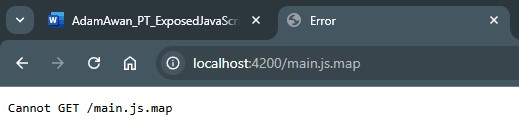

_Lachlan Robinson (220325142)_

## Summary of Finding

The audit conducted by AppAttack identified that the main.js.map file was accessible to
unauthenticated users at http://172.18.0.1:4200/main.js.map. As noted, source maps expose original
source code structures and may lead to reverse engineering or disclosure of sensitive implementation
details.

## Assessment and Remediation Status

We acknowledge this as a valid concern and appreciate the identification. However, it is important
to clarify that:

- The main.js.map file is only present in development builds of the application.

```
"development": {
              "optimization": false,
              "extractLicenses": false,
              "sourceMap": true
            }
```

- In our deployment process, production builds are created using the Angular CLI with the
  --configuration production flag, which disables the generation and exposure of source maps by
  default.

```
"production": {
              "budgets": [
                {
                  "type": "anyComponentStyle",
                  "maximumWarning": "6kb"
                }
              ],
              "fileReplacements": [
                {
                  "replace": "src/environments/environment.ts",
                  "with": "src/environments/environment.prod.ts"
                },
                {
                  "replace": "src/app/config/constants/apiURL.ts",
                  "with": "src/app/config/constants/apiURL.prod.ts"
                }
              ],
              "optimization": true,
              "outputHashing": "bundles",
              "sourceMap": false,
              "extractLicenses": true,
              "serviceWorker": "ngsw-config.json"
            },
```

- Therefore, in production environments, this file is not present, and the application does not
  expose source maps publicly.

  

## Recommendation for Retesting

For future vulnerability assessments, we recommend that penetration testing be performed against a
production-equivalent build of the front-end application. This ensures the test environment mirrors
the real-world deployment configuration and avoids false positives related to development-only
artifacts.
